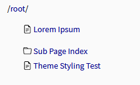
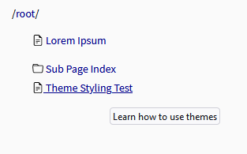
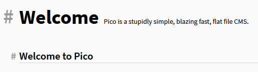

# Cluttering for Pico

This theme is a clone of Clutter by [Alan Luo](https://github.com/alan-luo/clutter) with some features disabled and some extensions.

This theme is optimised for the use in the [Pico App for Nextcloud](https://apps.nextcloud.com/apps/cms_pico). Therefore all imported scripts from the CDNs used must be replaced by local scripts placed in the respective folders. This includes:

- scripts/jquery.min.js from <https://ajax.googleapis.com/ajax/libs/jquery/3.2.1/jquery.min.js>
- scripts/highlight.min.js from <https://cdnjs.cloudflare.com/ajax/libs/highlight.js/9.12.0/highlight.min.js>
- scripts/mousetrap.min.js from <https://cdnjs.cloudflare.com/ajax/libs/mousetrap/1.6.1/mousetrap.min.js>
- styles/default.min.css from <https://cdnjs.cloudflare.com/ajax/libs/highlight.js/9.12.0/styles/default.min.css>
- MathJax is not used.

The additional PHP plugin from the original theme is not necessary.

## Additional Features (compared to the original)

### Page Priorities

Pages can be assigned a priority in the Frontmatter of every Markdown file. This priority is used for the sidebar navigation order. You can set priorities 1, 2, 3 and 9 or leave it empty. 1-3 are shown above the 'standard' pages, 9 is shown below. This works also for folders (index.md).

```markdown
---
title: Lorem Ipsum
Priority: 1
---
```



### Page Descriptions

Each page can be given a description, which is shown when hovering over the sidebar item and next to the title of the page. This works also for folders (index.md).

```markdown
---
title: Theme Styling Test
Description: Learn how to use themes
---
```



### Icons for Folders and Pages

The icons can be seen in the screenshots above.

The SVGs are taken from the Bootstrap Icons library, which uses the [MIT licence](https://github.com/twbs/icons/blob/main/LICENSE.md): [File Earmark](https://icons.getbootstrap.com/icons/file-earmark-text/) and [Folder](https://icons.getbootstrap.com/icons/folder/)

### Minor Changes

- The Table of Contents contains h2 and h3 elements instead of only h2.
- Some changes to the design were applied, including (but not limited to) another link colour, full page width and images restricted to 100% width.